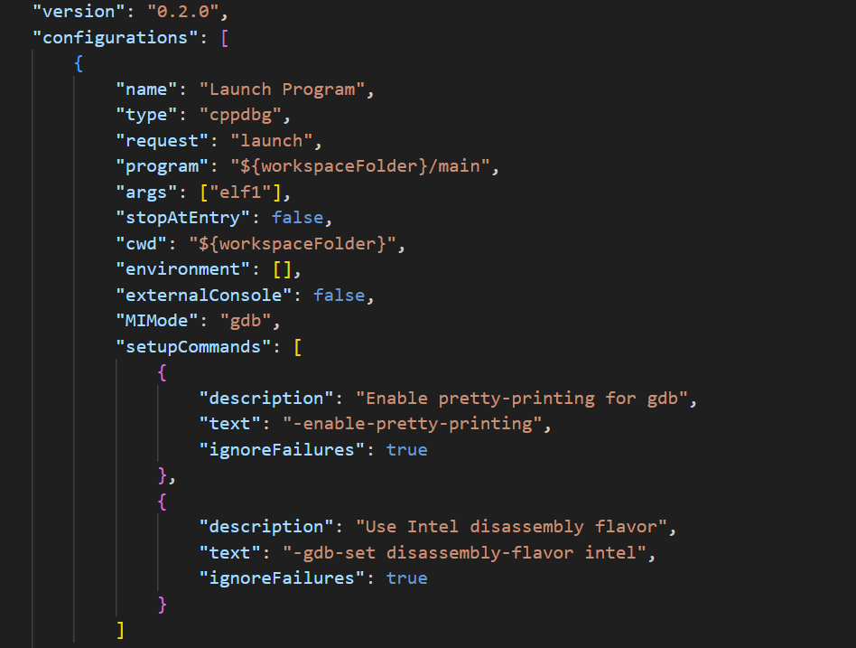

 CS5460/6450 Operating Systems   


[Home](../../index.html) 


Homework 2: ELF files
=====================

This assignment will make you more familiar with the organization of ELF files. You can complete it on any operating system that supports the Unix API—for example:

- Linux CADE machines
- Your own laptop running Linux (or a Linux VM)
- macOS only if your Mac is Intel (x86-64)

You do not need to set up xv6 for this assignment.

Submit your programs and shell through Gradescope.

**YOU CANNOT PUBLICLY RELEASE SOLUTIONS TO THIS HOMEWORK**. It's ok to show your work to your future employer as a private Git repo, however any public release is prohibited.


Part 1: Take a look at ELF files
--------------------------------

At a high level this homework first shows you how to implement a simple ELF loader [main.c](./main.c) file. We first use it to load a simple ELF object file compiled from
1. [elf.c](./elf.c) (requires no relocation).

and then later ask you to relocate it to run at the address at which you load it 

2. [elf1.c](./elf1.c) (requires relocation). 

However, before starting on this let's make ourselves familiar with ELF files.

We provide a simple [Makefile](Makefile) that compiles [elf_explain.c](./elf_explain.c). Let's go over this. 

``` {style="position: relative;"}
make elf_explain
```

Lets take a look at the ELF files we compiled. We will use the readelf tool

``` {style="position: relative;"}
$ readelf -a elf_explain
```
ELF is the file format used for object files (`.o`'s), binaries, shared libraries and core dumps in Linux.

It's actually pretty simple and well thought-out.

ELF has the same layout for all architectures, however endianness and word size can differ; relocation types, symbol types and the like may have platform-specific values, and of course the contained code is arch specific.

The ELF files are used by two tools: 1) linker and 2) loader. A linker combines multiple ELF files into an executable or a library and a loader loads the executable ELF file in the memory of the process. On real operating systems loading may require relocation (e.g., if the file is dynamically linked it has to be linked again with all the shared libraries it depends on). 

Linker and loader need two different views of the ELF file, i.e., they access it differently---the linker needs to know where the DATA, TEXT, BSS, and other sections are to merge them with sections from other libraries. If relocation is required the linker needs to know where the symbol tables and relocation information is.

The loader, however, does not need any of these details. It simply needs to know which parts of the ELF file are code (executable), which are data and read-only data, and where to put the BSS in the memory of a process.

Hence the ELF file provides two separate views on the data inside the ELF file: 1) a more detailed view for the linker, and 2) a bit more high-level view for the loader. To provide these views each ELF file contains two arrays: Section Header Table (for the linker), and Program Header Table (for the loader). Both tables are simply arrays of entries that contain information about each part of the ELF file (e.g., where the sections for the linker and section for the loader are inside the ELF file).

Here is a simple figure of a typical ELF file that starts with the ELF header. The header contains pointers to the locations of Section Header Table and Program Header Table within the ELF file. Then each tables have entries that point to the starting locations of individual sections and segments.


Lets take a look at both arrays.

Linking view: Section Header Table (SHT)
----------------------------------------

The Section Header Table is an array in which every entry contains a pointer to one of the sections of the ELF file. **It's a bit annoying but the parts of the ELF file used by the linker are called "sections", and the parts used by the loader are called "segments"** (my guess is that different CPU segments were configured in the past for each part of the program loaded in memory, hence the name "segments", for example, an executable CPU segment was created for the executable parts of the ELF file (i.e., one segment that contained all executable sections like .text, .init, etc.).

Also don't get confused: sections and segments overlap. I.e., typically multiple sections (.text, .init) are all contained in one executable segment. Confusing, huh? It will become clear soon.

Lets take a look at what inside the ELF file. Run this command

``` {style="position: relative;"}

readelf -a elf_explain

```

If you scroll down to the **Section headers** you will see all "sections" of the ELF file that the linker can use:

```
Section Headers:
  [Nr] Name              Type             Address           Offset Size              EntSize          Flags  Link  Info  Align
  [ 0]                   NULL             0000000000000000  00000000 0000000000000000  0000000000000000           0     0     0
  [ 1] .note.gnu.pr[...] NOTE             0000000000400190  00000190 0000000000000020  0000000000000000   A       0     0     8
  [ 2] .note.gnu.bu[...] NOTE             00000000004001b0  000001b0 0000000000000024  0000000000000000   A       0     0     4
  [ 3] .gnu.hash         GNU_HASH         00000000004001d8  000001d8 000000000000001c  0000000000000000   A       4     0     8
  [ 4] .dynsym           DYNSYM           00000000004001f8  000001f8 0000000000000018  0000000000000018   A       5     1     8
  [ 5] .dynstr           STRTAB           0000000000400210  00000210 0000000000000001  0000000000000000   A       0     0     1
  [ 6] .rela.text        RELA             0000000000400218  00000218 0000000000000060  0000000000000018  AI       4     7     8
  [ 7] .text             PROGBITS         0000000000400278  00000278 0000000000000055  0000000000000000 WAX       0     0     1
  [ 8] .eh_frame         PROGBITS         00000000004002d0  000002d0 0000000000000000  0000000000000000   A       0     0     8
  [ 9] .dynamic          DYNAMIC          00000000004002d0  000002d0 0000000000000110  0000000000000010  WA       5     0     8
  [10] .data             PROGBITS         00000000004003e0  000003e0 0000000000000008  0000000000000000  WA       0     0     4
  [11] .bss              NOBITS           00000000004003e8  000003e8 0000000000000008  0000000000000000  WA       0     0     4
  [12] .comment          PROGBITS         0000000000000000  000003e8 000000000000002b  0000000000000001  MS       0     0     1
  [13] .symtab           SYMTAB           0000000000000000  00000418 0000000000000120  0000000000000018          14     4     8
  [14] .strtab           STRTAB           0000000000000000  00000538 0000000000000042  0000000000000000           0     0     1
  [15] .shstrtab         STRTAB           0000000000000000  0000057a 000000000000008d  0000000000000000           0     0     1
Key to Flags:
  W (write), A (alloc), X (execute), M (merge), S (strings), I (info),
  L (link order), O (extra OS processing required), G (group), T (TLS),
  C (compressed), x (unknown), o (OS specific), E (exclude),
  D (mbind), l (large), p (processor specific)
```

The elf_explain.c is a simple program, but it still has .text, `.data`, `.bss`, and `.rel.text` (relocation) sections and a bunch of sections that contain symbol information and a ton of other stuff.

`elf_explain.c` has two initialized and one uninitialized global variables; therefore, the ELF file contains a .data section of 8 bytes for the initialized variables, and a .bss section of 8 bytes, of which 4 bytes are used by the uninitialized variable and the remaining space is added due to alignment and linker padding.

The program is linked to run `elf_explain.c` at address 0x400000, which is the default base address for 64-bit ELF executables on UNIX-like systems.

The symbol table contains the following symbols

``` {style="position: relative;"}
Symbol table '.symtab' contains 12 entries:
   Num:    Value          Size Type    Bind   Vis      Ndx Name
     0: 0000000000000000     0 NOTYPE  LOCAL  DEFAULT  UND 
     1: 0000000000000000     0 FILE    LOCAL  DEFAULT  ABS elf_explain.c
     2: 0000000000000000     0 FILE    LOCAL  DEFAULT  ABS 
     3: 00000000004002d0     0 OBJECT  LOCAL  DEFAULT    9 _DYNAMIC
     4: 00000000004003e0     4 OBJECT  GLOBAL DEFAULT   10 b
     5: 0000000000400278    60 FUNC    GLOBAL DEFAULT    7 quadruple
     6: 00000000004003e4     4 OBJECT  GLOBAL DEFAULT   10 c
     7: 00000000004003e8     0 NOTYPE  GLOBAL DEFAULT   11 __bss_start
     8: 00000000004003e8     4 OBJECT  GLOBAL DEFAULT   11 d
     9: 00000000004002b4    25 FUNC    GLOBAL DEFAULT    7 magic
    10: 00000000004003e8     0 NOTYPE  GLOBAL DEFAULT   10 _edata
    11: 00000000004003f0     0 NOTYPE  GLOBAL DEFAULT   11 _end
```

I.e., it contains names of the two functions quadruple and magic, three global variables b, c, and d. Other symbols like \_\_bss\_start, \_edata, and \_end are added by the linker to mark the start and end of the BSS, TEXT, and DATA sections.

Execution view: Program Header Table (PHT)
------------------------------------------

The Program Header Table contains information for the kernel on how to start the program. The `LOAD` directives determinate what parts of the ELF file get mapped into program memory.

In our elf example the program header defines four segments, but only two of them should be loaded by the operating system in memory to run.

``` {style="position: relative;"}

Program Headers:
  Type           Offset             VirtAddr           PhysAddr           FileSiz            MemSiz              Flags  Align
  LOAD           0x0000000000000190 0x0000000000400190 0x0000000000400190 0x0000000000000258 0x0000000000000260  RWE    0x8
  DYNAMIC        0x00000000000002d0 0x00000000004002d0 0x00000000004002d0 0x0000000000000110 0x0000000000000110  RW     0x8
  NOTE           0x0000000000000190 0x0000000000400190 0x0000000000400190 0x0000000000000020 0x0000000000000020  R      0x8
  NOTE           0x00000000000001b0 0x00000000004001b0 0x00000000004001b0 0x0000000000000024 0x0000000000000024  R      0x4
  GNU_PROPERTY   0x0000000000000190 0x0000000000400190 0x0000000000400190 0x0000000000000020 0x0000000000000020  R      0x8
  GNU_STACK      0x0000000000000000 0x0000000000000000 0x0000000000000000 0x0000000000000000 0x0000000000000000  RW     0x10
```


The only loadable section is linked to be loaded at address 0x400190. We can also look at the mappings of sections to segments (we will discuss what sections are below):

``` {style="position: relative;"}
 Section to Segment mapping:
  Segment Sections...
   00     .note.gnu.property .note.gnu.build-id .gnu.hash .dynsym .dynstr .rela.text .text .eh_frame .dynamic .data .bss 
   01     .dynamic 
   02     .note.gnu.property 
   03     .note.gnu.build-id 
   04     .note.gnu.property 
   05     
```


In other works, inside the first loadable segment the linker placed the following sections: .note.gnu.build-id, .gnu.hash, .dynsym, .dynstr, .rel.text, .text, .eh\_frame, .dynamic, .data, and .bss. We can inspect the elf binary with the objdump tool to see what is inside the `.text` section:


``` {style="position: relative;"}

$ objdump -d -M intel elf_explain

elf_explain:     file format elf64-x86-64


Disassembly of section .text:

0000000000400278 <quadruple>:
  400278:       f3 0f 1e fa             endbr64
  40027c:       55                      push   rbp
  40027d:       48 89 e5                mov    rbp,rsp
  400280:       89 7d fc                mov    DWORD PTR [rbp-0x4],edi
  400283:       48 b8 e4 03 40 00 00    movabs rax,0x4003e4
  40028a:       00 00 00 
  40028d:       8b 00                   mov    eax,DWORD PTR [rax]
  40028f:       0f af 45 fc             imul   eax,DWORD PTR [rbp-0x4]
  400293:       89 c1                   mov    ecx,eax
  400295:       48 b8 e0 03 40 00 00    movabs rax,0x4003e0
  40029c:       00 00 00 
  40029f:       8b 10                   mov    edx,DWORD PTR [rax]
  4002a1:       48 b8 e8 03 40 00 00    movabs rax,0x4003e8
  4002a8:       00 00 00 
  4002ab:       8b 00                   mov    eax,DWORD PTR [rax]
  4002ad:       0f af c2                imul   eax,edx
  4002b0:       01 c8                   add    eax,ecx
  4002b2:       5d                      pop    rbp
  4002b3:       c3                      ret

00000000004002b4 <magic>:
  4002b4:       f3 0f 1e fa             endbr64
  4002b8:       55                      push   rbp
  4002b9:       48 89 e5                mov    rbp,rsp
  4002bc:       48 b8 e0 03 40 00 00    movabs rax,0x4003e0
  4002c3:       00 00 00 
  4002c6:       8b 00                   mov    eax,DWORD PTR [rax]
  4002c8:       6b c0 0e                imul   eax,eax,0xe
  4002cb:       5d                      pop    rbp
  4002cc:       c3                      ret
```

Well, no surprises: it's the code of the two functions we defined in `elf_explain.c`.

Here it would be interesting to remove the compiler flags `-fno-pic -mcmodel=large` and see the disassembly of text section. There won't be any absolute addresses and everything will be relative to `rip`. With PIC enabled (and without the large code model), the compiler usually avoids putting fixed 64-bit addresses directly into the instruction stream. Instead of `movabs rax, 0x...` (an absolute address), it will typically access globals using RIP-relative addressing, like `[rip + offset]`. That means the code uses addresses relative to the current instruction pointer `rip`, so it can be loaded at different locations in memory without changing the instructions. This is the main idea behind position-independent code. Read more about this [here](https://eli.thegreenplace.net/2011/11/11/position-independent-code-pic-in-shared-libraries-on-x64)

Putting it all together: the ELF header
---------------------------------------

Neither the SHT nor the PHT have fixed positions, they can be located anywhere in an ELF file. To find them the ELF header is used, which is located at the very start of the file.

The first bytes contain the elf magic `"\x7fELF"`, followed by the class ID (32 or 64 bit ELF file), the data format ID (little endian/big endian), the machine type, etc.

At the end of the ELF header are then pointers to the SHT and PHT. Specifically, the Section Header Table which is used by the linker starts at byte 1544 in the ELF file, and the Program Header Table starts at byte 64 (right after the ELF header)

``` {style="position: relative;"}
ELF Header:
  Magic:   7f 45 4c 46 02 01 01 00 00 00 00 00 00 00 00 00 
  Class:                             ELF64
  Data:                              2's complement, little endian
  Version:                           1 (current)
  OS/ABI:                            UNIX - System V
  ABI Version:                       0
  Type:                              EXEC (Executable file)
  Machine:                           Advanced Micro Devices X86-64
  Version:                           0x1
  Entry point address:               0x400278
  Start of program headers:          64 (bytes into file)
  Start of section headers:          1544 (bytes into file)
  Flags:                             0x0
  Size of this header:               64 (bytes)
  Size of program headers:           56 (bytes)
  Number of program headers:         6
  Size of section headers:           64 (bytes)
  Number of section headers:         16
  Section header string table index: 15
```

The entry point of this file is at address 0x400278. This is exactly what we told the linker to do --- make the function `quadruple` the entry point ( this is done with the following directive to the linker from the Makefile `-e quadruple`.

You might ask a question: why are we making the `quadruple()` function to be the entry point? Or in other words, why do we pick it instead of `main()`? The reason is that it gives us the way to know where `quadruple()` is in the text section so we can invoke it right after loading the file. Without making it an entry point we would have to read the symbol table which is doable but would take some additional time.

Program loading in the kernel
-----------------------------

The execution of a program starts inside the kernel, in the exec("/bin/wc",...) system call takes a path to the executable file. The kernel reads the ELF header and the program header table (PHT), followed by lots of sanity checks.

The kernel then loads the parts specified in the LOAD directives in the PHT into memory. If an INTERP entry is present, the interpreter is loaded too. Statically linked binaries can do without an interpreter; dynamically linked programs always need /lib/ld-linux.so as interpreter because it includes some startup code, loads shared libraries needed by the binary, and performs relocations.

Finally control can be transferred to the entry point of the program or to the interpreter, if linking is required.

In case of a statically linked binary that's pretty much it, however with dynamically linked binaries a lot more magic has to go on.

First the dynamic linker (contained within the interpreter) looks at the .dynamic section, whose address is stored in the PHT.

There it finds the NEEDED entries determining which libraries have to be loaded before the program can be run, the *REL* entries giving the address of the relocation tables, the VER* entries which contain symbol versioning information, etc.

So the dynamic linker loads the needed libraries and performs relocations (either directly at program startup or later, as soon as the relocated symbol is needed, depending on the relocation type).

Finally control is transferred to the address given by the symbol _start in the binary. Normally some gcc/glibc startup code lives there, which in the end calls main().

## Using AI + Codex

For this assignment you are allowed to use Codex to implement certain aspects on your code. Refer to [HW01](https://mars-research.github.io/cs5460/2026/homework/hw1-shell/#using-ai--codex) for instructions on how to get started with Codex. 


Part 1: Build a simple ELF loader
=========================

### Example: load an ELF file

While ELF might look a bit intimidating, in practice the loading algorithm is rather simple:

- Read the ELF header (This [Wiki](https://en.wikipedia.org/wiki/Executable_and_Linkable_Format) page should help).
- One of the ELF header fields tells you the offset of the program header table inside the file.
- Read each entry of the program header table (i.e., read each program header)
Each program header has an offset and size of a specific segment inside the ELF file (e.g., a executable code). You have to read it from the file and load it in memory.
- When done with all segments, jump to the entry point of the program. (Note since we don’t control layout of the address space at the moment, we load the segments at some random place in memory (the place that is allocated for us by the mmap() function). Obviously the address of the entry point should be an offset within that random area.

In this part of the assignment, your task is to build the ELF loader. Use [main.c](./main.c) as a template that provides required header files, structure definitions, and some helper functions and extend it with the functionality of the loader.

Specifically, we ask you to load an ELF file like `elf` which you can compile from [elf.c](./elf.c)

First we create a very simple ELF file out of elf.c --- it contains only one function, it has no data, and the code can be placed anywhere in memory and will run ok (it simply does not refer to any global addresses --- all variables are on the stack).

Then we do a loop through all loadable segments of the file and find the min and max virtual addresses at which the sections can be loaded. Segments can be out-of-order with respect to their virtual addresses and we want to know the range of the addresses that will be used in the end.
```
for (int i = 0; i < elf.e_phnum; ++i) {
    if (phs[i].p_type != PT_LOAD) continue;
    if (phs[i].p_vaddr < min_vaddr){
        // TO DO...
    }
    if (phs[i].p_vaddr + phs[i].p_memsz > max_vaddr){
        // TO DO...
    }
}
```
To load the segment in memory, we use mmap to get an executable memory from the OS. You can man mmap to read more.
```
code_va = mmap(NULL, page_align(max_vaddr - min_vaddr),
                     PROT_READ | PROT_WRITE | PROT_EXEC,
                     MAP_ANONYMOUS | MAP_PRIVATE, 0, 0);
```
Now let us load all the loadable program segments
```
for (int i = 0; i < elf.e_phnum; i++) {
    if (phs[i].p_type != PT_LOAD) continue;
    void *seg = (uint8_t *)load_base + (phs[i].p_vaddr - min_vaddr);

    fseek(f, phs[i].p_offset, SEEK_SET);
    fread(seg, 1, phs[i].p_filesz, f);

    if (phs[i].p_memsz > phs[i].p_filesz) {
      // TO DO...
    }
} 
free(phs);
```

You should figure out where the entry point of your program is (it is in one of the segments, and since you map the segments at the addresses returned by the mmap() function, you need to find where it ends up in your address space.

If you found the entry point then type cast it to the function pointer that matches the function signature of the sum function and call it.
```
if (entry_point) {
    add = entry_point;
    ret = add(1, 2);
    printf("add:%d\n", ret);
}
```
**Note: You don't need to perform relocation yet!**

Part 2: Explain the Crash
=========================
Test your loader with [elf1.c](./elf1.c). You can use `Makefile`: `make elf1`. Specifically you need to make sure to use the same flags as mentioned in the `Makefile`.

Before relocation, your loader will:

- successfully load the program
- crash or compute the wrong result

Use a debugger and disassembly to explain:

- Which instruction fails
- what address it is trying to access
- why that address is invalid
- how this relates to virtual addresses and loading location

Submit this explanation as `explain.(txt/md/pdf)`

### Debugging with VS Code. 

`./main elf1` either crashed or computed the wrong result. Specifically, you should start the program using Visual Studio debugger as we did for [HW01](https://mars-research.github.io/cs5460/2026/homework/hw1-shell/#debugging-c-with-vscode).

Pass `elf1` as input to `args` in the `launch.json` file as shown in the image below. Update the `program` and `cwd` fields to the respective directory where you have `main.c` and other files to execute.




Refer to [HW01](https://mars-research.github.io/cs5460/2026/homework/hw1-shell/#breakpoints-and-single-stepping) for how to set a breakpoint on main and start the program using VS debugger. 

Once debugging has started, right-click anywhere in the file and select `Open Disassembly View` as shown in the image below to view the assembly code and source code side by side.


Register information can also be viewed under the variables section on the top left of the window as shown in the above image.

Clicking the small icon on any of the variables will display the binary data (aka "memory") as shown in the image below.


Part 3: Perform Relocation
=========================

Ok now we are ready to perform relocation and compute the result of `linear_transform(5)`!

Specifically, our goal is to learn how to relocate a binary. In the step above we loaded the binary in memory, but it crashes as it was linked to run at an address which is different from the one we loaded it at. Below we will relocate `elf1` to run correctly by patching all references to the global variables that need to be relocated.

Let us start by loading the ELF section header table into memory used for relocation. 
```
Elf64_Shdr *shs =
        load_multiple(f, elf.e_shoff, elf.e_shnum * sizeof(Elf64_Shdr), sizeof(Elf64_Shdr), NULL);
```
Next, we iterate over all section headers to locate and load relocation tables, the symbol table, and the associated string table.

```
for (int i = 0; i < elf.e_shnum; i++) {
  Elf64_Shdr *sh = shs + i;
  switch (sh->sh_type) {
    case SHT_RELA:
      // TO DO...
    case SHT_REL:
      // TO DO...
    case SHT_SYMTAB:
      // TO DO...
    case SHT_STRTAB:
      // TO DO...
  }
}
```

The section table contains a number of entries that contain various information used by the linker (as we discussed above). Specifically, each entry has the following C type definition:
```
// ### Section Header
typedef struct {
    uint32_t sh_name;
    uint32_t sh_type;
    uint64_t sh_flags;
    uint64_t sh_addr;
    uint64_t sh_offset;
    uint64_t sh_size;
    uint32_t sh_link;
    uint32_t sh_info;
    uint64_t sh_addralign;
    uint64_t sh_entsize;
} Elf64_Shdr;
```
The sh_type defines the type of the entry. The following types are defined by the ELF standard (we only list a subset of types we need in this homework, see ELF standard for a complete list):
```
#define SHT_SYMTAB  2 // Symbol table
#define SHT_STRTAB  3 // String table
#define SHT_RELA    4 // Relocation entries with addends
#define SHT_REL     9 // Relocation entries without addends
```
To relocate a file we will have to iterate through all section header entries of our ELF file and pick the one that has the `SHT_REL` type.
Relocation entires in the table are continuous and the number of entries in a given table can be found by dividing the size of the table (given by `sh_size` in the section header) by the size of each entry (given by `sh_entsize`).

Each relocation entry has the following type:
```
// ### Relocation Entry
typedef struct {
    uint64_t r_offset;
    uint64_t r_info;
} Elf64_Rel;
```
The value stored in r_info, as the upper byte designates the entry in the symbol table to which the relocation applies, whereas the lower byte stores the type of relocation that should be applied.
```
#define ELF64_R_TYPE(val) ((val) & 0xffffffff)
#define ELF64_R_SYM(val)  ((val) >> 32)
```
We use the following macros to access type and symbol table entry.
The value in r_offset gives the relative position of the symbol that is being relocated, within its section.

The real messy part about relocation is that there can be different kinds of relocation actions. You can find the complete list defined by the ELF standard here: [x64: Relocation Types](https://docs.oracle.com/cd/E19120-01/open.solaris/819-0690/chapter7-2/index.html).

In our example, the elf is compiled to require the R_X86_64_RELATIVE relocation. Specifically, this relocation type just asks you to read the value (addend) from the relocation address specified by the r_offset field of the relocation entry and add it to the base address at which the ELF is loaded. This is simple – no need to access the symbol table, just read the value that is already there, add the base address and write it back.

Just to illustrate it with an example of relocating the access to `b` in the `magic` function (`elf_explain.c`):
```
00000000004002b4 <magic>:
  4002b4:       f3 0f 1e fa             endbr64
  4002b8:       55                      push   rbp
  4002b9:       48 89 e5                mov    rbp,rsp
  4002bc:       48 b8 e0 03 40 00 00    movabs rax,0x4003e0
  4002c3:       00 00 00 
  4002c6:       8b 00                   mov    eax,DWORD PTR [rax]
  4002c8:       6b c0 0e                imul   eax,eax,0xe
  4002cb:       5d                      pop    rbp
  4002cc:       c3                      ret
```
Right now `b` is in the data section at address `0x4003e0`. You can see the compiler generates `movabs` because it knows that this address will need to be patched by the loader depending on where your program is loaded. 
The relocation table contains the following entries
```
readelf -r elf_explain

Relocation section '.rela.text' at offset 0x218 contains 4 entries:
  Offset          Info           Type           Sym. Value    Sym. Name + Addend
000000400285  000000000008 R_X86_64_RELATIVE                    4003e4
000000400297  000000000008 R_X86_64_RELATIVE                    4003e0
0000004002a3  000000000008 R_X86_64_RELATIVE                    4003e8
0000004002be  000000000008 R_X86_64_RELATIVE   
```
Relocation section tells us that at address `0x4002be` we need to patch an address. Since we loaded it at address we’ve got from `mmap()` (i.e., the load_base in our code) we will relocate by (load_base - min_vaddr). Also, note that the offsets are in the virtual address space of the program, but since we loaded the segments starting from `load_base` you have to compute the correct offsets making sure they point into the loaded code in memory.


We are finally ready to apply relocations....

```
uint64_t delta = (uint64_t)load_base - min_vaddr;  // This gives us where the ELF was actually loaded
```
Apply all the necessary relocations. R_X86_64_RELATIVE require you to rewrite with load location plus some addend. 
**Note: You might have to first find out where an address needs to be patches before patching it.** 
```
if (relas) {
    for (size_t j = 0; j < relanum; ++j) {
        if (type == R_X86_64_RELATIVE) {
            // Apply relocations
        }
    }
    free(relas);
}
fclose(f); // Remember to close your file
```
Now you can load successfully load `elf1` binary and call `linear_transform(5)` similar to `add(1,2)` in `elf.c`.
```
if (entry_point) {
    linear_transform = entry_point;
    ret = linear_transform(5);
    printf("linear_transform'd to :%d\n", ret);
}
```
If everything goes well, you can see the result of `linear_transform(5)`, make sure to check it with different arguments are verify your result.
<!-- Part 3: ELF Analysis
==================
Answer the following in `explain.(txt/md/pdf)`

- Why does the kernel ignore section headers when loading a program?
- What is the difference between sections and segments?
- Why is `e_entry`? What does it point to?
- Why does loading at a different base address (no relocation) break the program?
- Show Process Virtual Memory Layout Before Loading and After Relocation.   -->


Part 4: (Extra Credit, 30%):
==================
For extra credit, extend your loader to support position-independent code (PIC). To do this, compile the input binary(`elf_extra_credit.c`). In this case, the compiler will generate RIP-relative memory accesses that go through the Global Offset Table (GOT) instead of using absolute addresses.

After compiling the input program (`elf_extra_credit.c`) as position-independent code and disassembling using `objdump -d -rR -M intel elf_extra_credit`
```
elf1:     file format elf64-x86-64

Disassembly of section .text:

0000000000001000 <linear_transform>:
    1000:       f3 0f 1e fa             endbr64
    1004:       55                      push   rbp
    1005:       48 89 e5                mov    rbp,rsp
    1008:       89 7d fc                mov    DWORD PTR [rbp-0x4],edi
    100b:       48 8b 05 de 2f 00 00    mov    rax,QWORD PTR [rip+0x2fde]        # 3ff0 <_GLOBAL_OFFSET_TABLE_+0x20>
    1012:       8b 00                   mov    eax,DWORD PTR [rax]
    1014:       0f af 45 fc             imul   eax,DWORD PTR [rbp-0x4]
    1018:       89 c1                   mov    ecx,eax
    101a:       48 8b 05 c7 2f 00 00    mov    rax,QWORD PTR [rip+0x2fc7]        # 3fe8 <_GLOBAL_OFFSET_TABLE_+0x18>
    1021:       8b 10                   mov    edx,DWORD PTR [rax]
    1023:       48 8b 05 ce 2f 00 00    mov    rax,QWORD PTR [rip+0x2fce]        # 3ff8 <_GLOBAL_OFFSET_TABLE_+0x28>
    102a:       8b 00                   mov    eax,DWORD PTR [rax]
    102c:       0f af c2                imul   eax,edx
    102f:       01 c8                   add    eax,ecx
    1031:       5d                      pop    rbp
    1032:       c3                      ret
```
You see, In this code, all global variable accesses go through the Global Offset Table. First, a RIP-relative load retrieves a pointer from the GOT. Second, the program dereferences that pointer to obtain the actual value of the global variable. This indirection is required because the final runtime addresses of global symbols are not known at compile time and may vary depending on where the binary is loaded.

When loading such a binary, the GOT will initially contain unresolved entries. Your loader must identify the GOT and apply the appropriate relocations so that each entry points to the correct runtime address. Once the GOT is properly populated, the PIC code should execute correctly from any load address.

**Linker Flags and Their Purpose**
Another thing to note here is that the flags we have used to compile `elf_extra_credit.c`

The -Wl, prefix is required to pass options directly to the linker. In particular, the --no-relax flag instructs the linker to disable relaxation optimizations. On x86-64, the linker normally attempts to optimize PIC code by removing unnecessary GOT indirections when it can prove that a symbol is local and non-interposable. This optimization can rewrite GOT-based accesses into direct RIP-relative memory references.

Submit your work 
----------------
Submit your solution through Gradescope. Please zip all of your files (main.c, Makefile) and submit them. The structure of the zip file should be the following:
``` {style="position: relative;"}

  - Makefile
  - main.c
  - explain.(txt/md/pdf)
```


Updated: February, 2025
